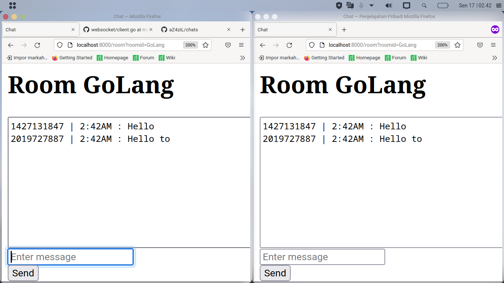

# Chats

Chats is a simple chat application built with Go programming. This project was built using the `http.Handler` and [gorilla/websocket](https://github.com/gorilla/websocket) modules.

## Screenshot

Below is a screenshot of the project execution results.

